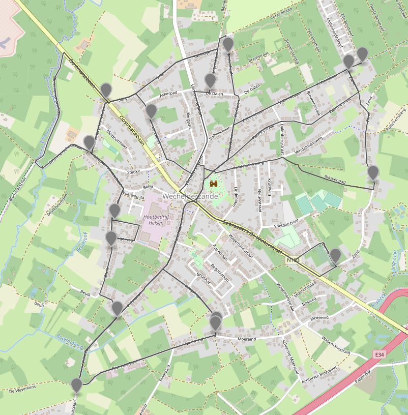

# itinero-directed-sequence-sample

A sample to demo calculation of a directed sequence.

This calculates a route along a sequence of locations **minimizing the u-turns** taken **without changing the order** of the locations.

